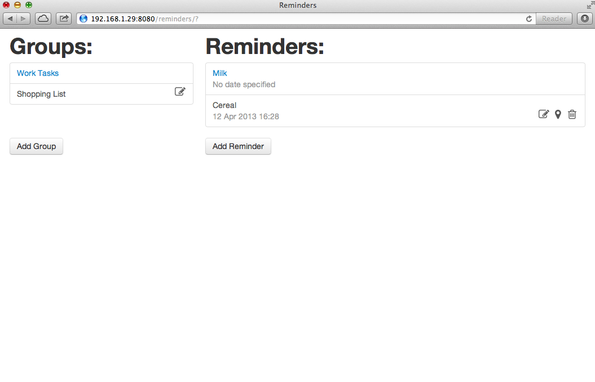
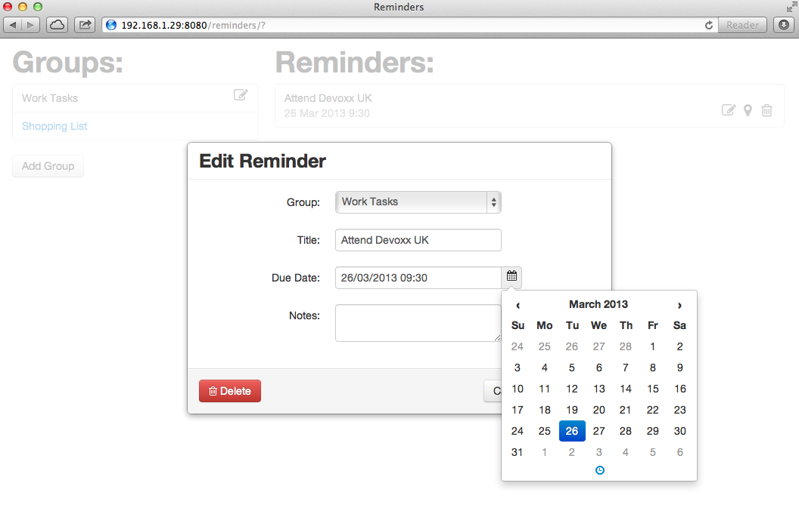
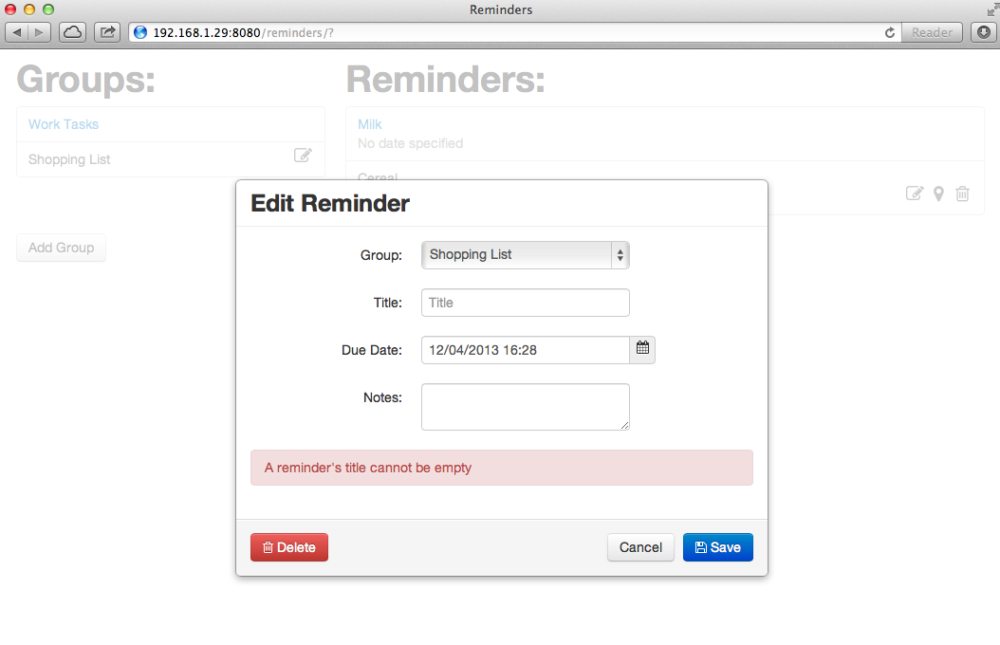
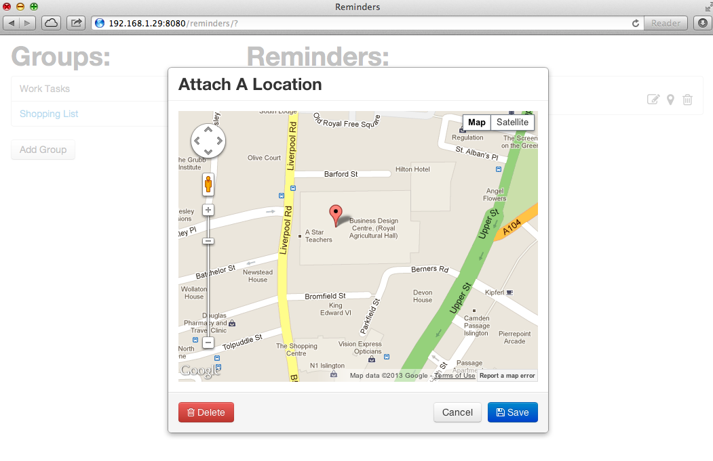
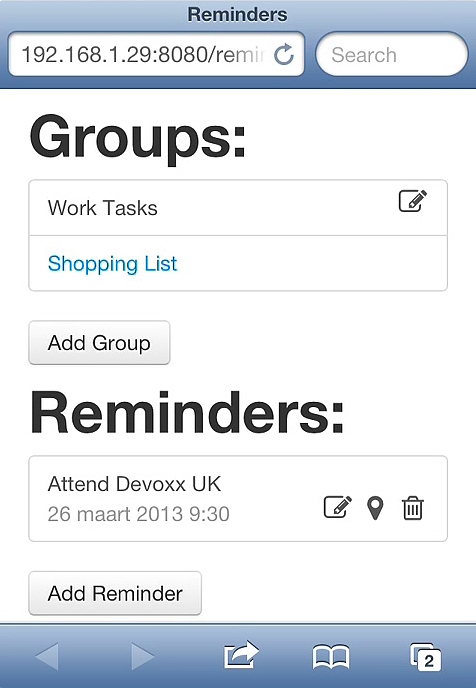
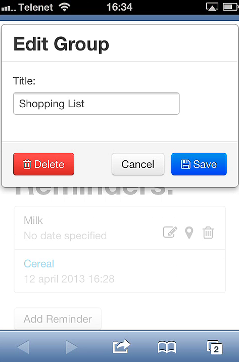

# Reminders

This web version of <a href="https://github.com/svanimpe/fx-reminders">Reminders</a> is a large example I made for students taking my course on web application development using Java EE 7. It covers the following topics:

- JPA:
    - Basic mapping of attributes, collections and relationships.
    - Automatically generated primary keys.
    - Embeddables.
    - EntityManager.
    - JPQL and named queries.
- Bean Validation:
    - Built-in validation constraints.
    - Custom validation constraints and validators.
    - Validation groups.
    - Manual validation using Validator.
- JAX-RS:
    - Resource creation using `@Path`, `@Consumes`/`@Produces`, `@GET`/`@POST`/`@PUT`/`@DELETE` and Response.
    - Parameters using `@PathParam`, `@QueryParam`, `@HeaderParam` and `@DefaultValue`.
    - Exception handling using built-in exception types.
    - Exception mapping.
    - Custom MessageBodyReaders and MessageBodyWriters.
    - Handling image uploads, downloads and storage.
- JSON:
    - JsonReader and JsonWriter.
    - JsonObject(Builder) and JsonArray(Builder).
- CDI:
    - `@RequestScoped`.
    - `@Inject`.
- JTA:
    - `@Transactional`.
- Security:
    - HTTP Basic Authentication using a GlassFish JDBC Realm.
    - Security constraints in `web.xml`.
    - Checking credentials in JAX-RS using SecurityContext.
- Testing:
    - Basic unit testing using JUnit.
    - Testing with mock objects using Mockito.
    - Integration testing using Arquillian.
    - End-to-end testing using Arquillian and JAX-RS Client API.

The front-end was built using jQuery and Twitter Bootstrap. It was originally built for an earlier version of the webservice that did not include any authentication. I've updated it to use the API of the new webservice and set it up to use the default administrator account that gets created when you first deploy the application. Other than that, the front-end hasn't been updated so don't take it as an example of best practices.

## Screenshots

## Setup

To run this example on a local GlassFish installation, you will need to:

- Change the JDBC resource and connection pool settings in `sun-resources.xml` to point to an empty schema. Make sure you keep the name `jdbc/reminders`. Also make sure GlassFish has the required driver installed in the `lib` folder of the domain you're using.
- Set up the security realm. You can do this via the GlassFish administration console at <a href="http://localhost:4848">http://localhost:4848</a>. Browse to `Configurations` > `server-config` > `Security` > `Realms` and create a realm with the following settings:
    - Realm Name: `remindersRealm`
    - Class Name: `com.sun.enterprise.security.ee.auth.realm.jdbc.JDBCRealm`
    - JAAS Context: `jdbcRealm`
    - JNDI: `jdbc/reminders`
    - User Table: `USER_PASSWORD`
    - User Name Column: `USERNAME`
    - Password Column: `PASSWORD`
    - Group Table: `USER_ROLES`
    - Group Table User Name Column: `USERNAME`
    - Group Name Column: `ROLES`
    - Password Encryption Algorithm: `SHA-256`
- Change the `IMAGES_BASE_DIR` in the Utilities class to point to an existing directory on your machine.
- Copy the `default.png` image (it's included in the files used for testing) to that directory.
- Deploy.

The application should now be running on <a href="http://localhost:8080/reminders">http://localhost:8080/reminders</a>. The webservice can be found at <a href="http://localhost:8080/reminders/api">reminders/api</a>, its API documentation at <a href="http://localhost:8080/reminders/docs">reminders/docs</a>.

The database schema will be created when you first deploy the application. Once this is done, you can edit `persistence.xml` to set the table generation strategy to `none`.

## Testing

To enable the included tests, modify `pom.xml` to set `<skipTests>` to `false`. The tests will connect to your database so make sure you modify `test-glassfish-resources.xml` in the same way you modified `sun-resources.xml`.  It's best to use a separate schema for your tests as every run of the tests will drop and create the generated tables. The tests will run on an embedded GlassFish server. I did not change the ports so make sure GlassFish is not already running or the embedded server will not be able to start. The test files include a `domain.xml` configuration file for the embedded server. This configuration file already includes the security realm so no setup is required.

Upon running the tests, you should see 126 green lights. This is a complete test suite for the Credentials and Users resources, testing every aspect from simple business logic to validation, persistence and complete use case scenario's. The Lists and Reminders resources don't have test suites yet, but as they are very similar to the Users resource, you might want to try writing these tests yourself, as an exercise.

To interact directly with the webservice, I recommend you use <a href="http://www.getpostman.com">Postman</a>.

This repository contains a Maven project. It was last tested using NetBeans 8.0.2, GlassFish 4.1, JDK 8u25 and MySQL 5.6.
